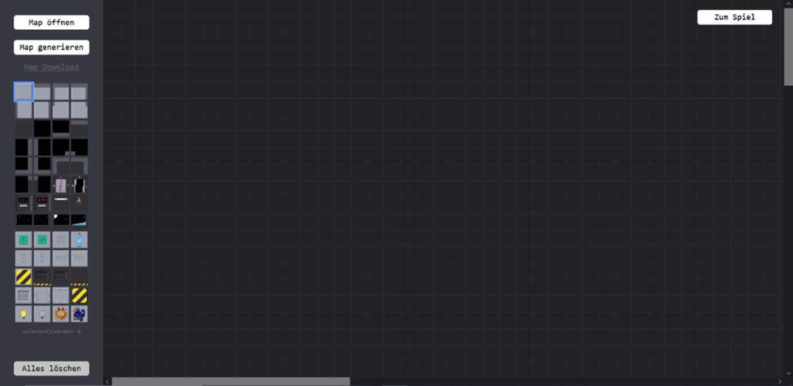
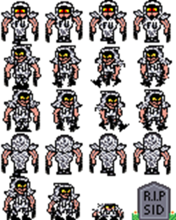
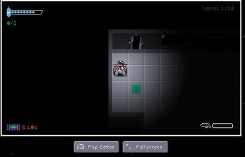

# TSDA

## Game Genre
Beat ’em up, shooter

## Target Audience
FSK 12

## Target Plattform
Website

## Controls
- **WASD or Arrow Keys:** Movement
- **Space:** Shoot
- **E:** Interact

## Hints

- Player msut pay attention to the oxygen Capacity because if it is empty, he will die
- Gather light sources to improve vision for a short time
- It is best to make a note of the push plates before you start the terminal, as there is a countdown will be and when it reaches 0, Game Over

## Description

It's a 2D pixel, top down game in which the player takes on the role of Sid Beill, the best agent of the T.S.D.A (Terra Space Defense Association). The task is to make the alien spaceships explode through targeted infiltration. In order to achieve this goal, the player must keep in mind some important factors, always keep a cool head, dodge and eliminate enemies, and keep an eye on the clock.

His main goal is to save humanity from extinction, This means that he is on board a spaceship that is still unknown to him and has to get to the energy generators. He has to short-circuit the generators and flee the spaceship before the detonation.

There are a few oxygen tanks on the map, with which he can refresh his oxygen supply.

His enemies are cunning, moving fast and unpredictably. Some react to him and take up the chase. Sid can defend himself with his pistol and shoot at his enemies.

The tile with the lightbulb on it causes the restricted view to be lifted for a few seconds. If the light bulb has already been used, it is no longer yellow but gray.

 A pre-game menu that gives access to a dedicated map editor, allowing players to implement their own creative ideas.

The game is scalable, meaning it can be played in windowed mode or full screen. There are different tiles, which also react differently to the player. For example, switches are pressed, items are collected. He stops at walls. He can run into them or open doors by pressing switches. The player and the aliens can run diagonally and attack/shoot, which can be done by pressing 2 buttons at the same time.

The weapon can overheat, so shoot with caution should.

And here is a snippet of the player's sprite.

## Level Design

You have to activate certain screens (terminals) by pressing the “E” key.

 In the given time, you should activate all green platforms on the ground to open the door to the next level. 
 

## Credits
- **Programmer:** [Tariq Alsalem](https://github.com/ShadierPond)
- **Programmer:** [Anastasia Naumann](https://github.com/ElPatronWhizzKey)
- **Programmer:** David Einenkel
- **Programmer:** Sven Bräumer